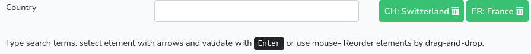

# Tagsinput

[By Sébastien L'haire](http://sebastien.lhaire.org)

A Laravel library with jQuery add on to add tags input field with auto-completer.

It uses:

* a Javascript auto-complete script based on [jQuery](https://jquery.com/) Javascript framework.
* [Bootstrap](https://getbootstrap.com/) 4 CSS Framework.
* package [seblhaire/autocompleter](https://github.com/seblhaire/autocompleter)



Demo site available [here](https://sebastien.lhaire.org/tagsinput).

## Installation

1. `composer require seblhaire/tagsinput`
2. Composer will automatically link the package with Laravel. But you still can explicitely add provider and facade to your `config/app.php`:
```php
  'providers' => [
    ...
      Seblhaire\Autocompleter\AutocompleterServiceProvider::class,
      Seblhaire\Tagsinput\TagsinputServiceProvider::class,
      ...
    ],
    'aliases' => [
        ...
        "AutocompleterHelper" => Seblhaire\Autocompleter\AutocompleterHelper::class,
        'TagsinputHelper' => Seblhaire\Tagsinput\TagsinputHelper::class
      ]
```
3. Publish package (optionally).
``` sh
$ php artisan vendor:publish
```

4. For Javascript and stylesheets, see next section.

## Javascript ans stylesheets

On a webpage, every JS library and CSS stylesheets can be linked separately. If you choose this classical way, first dowload and install above mentioned libraries or use Content Delivery Network (CDN) links as in the example page in last section. Then publish package files as explained above and put following tags in your template:

```html
<script type="text/javascript" src="js/vendor/seblhaire/autocompleter/autocompleter.js"></script>
<script type="text/javascript" src="js/vendor/seblhaire/tagsinput/tagsinput.js"></script>
<link rel="stylesheet" type="text/css" property="stylesheet" href="css/vendor/seblhaire/autocompleter/autocompleter.css"/>
<link rel="stylesheet" type="text/css" property="stylesheet" href="css/vendor/seblhaire/tagsinput/tagsinput.css"/>
```

But websites often use many libraries and stylesheets and browser must download many files before the site can be rendered properly. Modern websites come with a single compressed Javascript file which concatenates necessary scripts; same principle for stylesheets. With Laravel you can use [Laravel Mix](https://github.com/JeffreyWay/laravel-mix) to compile files.

Use [NPM](https://www.npmjs.com/) package manager :
`npm install bootstrap jquery`

Then your js source file should be something like this:

```js
global.jQuery = require('jquery');
var $ = global.jQuery;
var jQuery = global.JQuery;
window.$ = $;
window.jQuery = jQuery;
require('bootstrap');
require('../../vendor/seblhaire/autocompleter/resources/js/autocompleter.js');
require('../../vendor/seblhaire/tagsinput/resources/js/tagsinput.js');
```

For your stylesheet:

```css
@import '~bootstrap/scss/bootstrap';
@import "../../vendor/seblhaire/autocompleter/resources/css/autocompleter";
@import "../../vendor/seblhaire/tagsinput/resources/css/tagsinput";
```
## Configuration file

Tagsinput library is customizable. Default values can be changed, either in configuration file, or by passing options in Facade function (see next section). If you want to modify default configuration file, publish package files and access to `config/autocompleter.php` and `config/tagsinput.php`.

## Usage
Tagsinput package comes with a simple Facade.

### TagsinputHelper::init
Inits a tagsinput object and an autocompleter object that can be passed to the view.

`TagsinputHelper::init($divid, $label, $url, $optionsAc, $optionsTags)` where:

* ``$divid``: identifier of `<div>` that contains tags input component;
* `$label`: label of tags input component;
* `$url` : route that must be used by autocompleter to load data. See [seblhaire/autocompleter](https://github.com/seblhaire/autocompleter)
* `$optionsAc`: autocompleter component option; array of options. See [seblhaire/autocompleter](https://github.com/seblhaire/autocompleter). Option `'helptext'` is automatically overriden. Option `'callback'` is set by default by Tagsinput component, but you can write your own callback in case you need it.
* `$optionsTags`: array of options.
   * ` 'maindivclass'` : class for main component `<div>`. Default: `'form-group row'`.
   * `'divlabelclass'`: class for `<div>` containing component label. Default:  `'col-sm-2'`.
    * `'divacclass'`: class for `<div>` containing autocompleter component. Default:  `'col-sm-3'`.
   * `'divtaglist'`:  class for `<div>` containing tags. Default: `'col-sm-7'`.
   * `'inputcontainerclass'`:  class for `<div>` containing `<input>` tag and button. Default:  `'input-group'`.
    * `'addbuttoncontainerclass'`: class for `<div>` containing `<button>` tag. Default: `'input-group-append'`.
    * `'addbuttonclass'`:   class for  `<button>`.  Default: ` 'btn btn-primary'`.
     * `'buttonlabelclass'`:  class for  `<button>`label. Default: `'fas fa-plus-circle'`.
    * `'taglistclass'`: class for `<ul>` tag containing tag list.  Default: `'taglist'`.
	 * `'tagclass'`: class for tag. Default:  `'bg-primary'`.
    * ` 'tagremovebtnclass'`: class for `<i>` tag containing tag remove button. Default: `'fas fa-trash-alt'`.
   * ` 'helptextclass'`: class for `<p>` tag containing help text. Default: `'taginputhelper'`.
  `'helptext'`  text to be displayed for help. Text can be string or translation key.  Cf [below](#translation_keys).
    * `'showaddbutton'` : toggles display of add element button. Default: `true`.
    * `'addbuttoncallback'`: name of function which must be triggered when clicking to add new element. Eg: this callback should display a form to add information. Default:  `null`.
    * `'tagaddcallback'`:  name of function which must be triggered when a new tag is added. Default: `null`.
   * `'tagremovecallback'`: name of function which must be triggered when a tag is removed. Default: `null`.
    * `'taglabelelement'`:  name of field in autocompleter result line containing text to display in tag. Default: `'taglabel'`. See [seblhaire/autocompleter](https://github.com/seblhaire/autocompleter).
    * `tagclasselement`: name of field in autocompleter results line that can be used to set a special tag class that is not the class by default. Default: `tagclass`.
   * `'field'`: name of field in result line containing data identifier or key. Default: `'id'.` See [seblhaire/autocompleter](https://github.com/seblhaire/autocompleter).
    * `'checkunicity'`: specify if value in tag list must be unique. If true, if same tag is selected twice, the second one is ignored and is not added to list. Default: `true`.

To summarize in your controller insert:
```
$tagszone = TagsinputHelper::init(
      "tagzone",
      'Employee',
      route('tagsinputsearch'),
      [
        'resdivstyle' => [ //position autocompleter result list
          'width' => '430px',
          'top' => '-18px'
        ],
        'csrfrefreshroute' => route('refreshcsrf') // route called if csrf token must be reloaded
      ],
      [
        'tagaddcallback' => 'showlist', // callback functions called after tag is addded
        'tagremovecallback' => 'showlist'
      ]
    );
    ...
    return view('tagsinput', [
      ...
      'tagszone' => $tagszone,
      ...
      ]);
```
In your blade template, insert following at the place you want the tags list to appear:

`{!! $tagszone !!}` or `{!! $tagszone->output() !!}`

### Output methods

#### output()
This method `output()` prints tags and outputs tagsinput and autocompleter initialization script. It uses the above methods that you can also use to organize your code as you wish.

#### printLabel()
This method prints the label `<div>`.
#### printAutocompleter()
This method prints  the autocompleter zone.
#### printTagList()
This method prints the tag list zone.
#### printHelpText()
This method prnts help text zone.
#### printAcCallback()
Prints autocompleter callback to add a new tag to list.
#### printTagInputInit()
Prints initialization of autocompleter and tagsinput objects. Better insert it in jQuery(document).ready clause.

Following methods can be used to manage tags list and to send tags list to other scripts with different formats.
#### printReset()
Empties tags list.

#### printCount()
Returns current tags list size.

#### printGetArrayValues()
Returns an array of tags list values. Eg:  ["CH","FR"]

#### printGetCommaSepValues()
Returns a string with tags list values separated by comma. Eg.: CH,FR

#### printSerialize($champ)
Returns serialized values that can be used in a Javascript string to send values to a controller.
In a blade template write for example:
```
<script>
let params = {!! $tagszone->printSerialize('country') !!}`
</script>
```
will output something like:
`let params = jQuery('#tagzone_taglist').data('tagsinput').serialize('country');`
and content of variable params will be: `country[]=CH&country[]=FR`

#### printAddToList($varia)
This method can be used to pre-add values to the tag list at page initialization or after loading data by an Ajax script. `$varia` can be a simple Json object or an array of objects. `{code:'CH', taglabel:'CH: Switzerland'}` is an object that contains 2 fields: `code` labels the label value, the unique identifiers that will be return in tags list. This is the value of option `field`, Cf. above. `tagnsinput` is the label that will be displayed in tag, corresponding to option `taglabelelement`. Array of object is a comma-separated string of objects in square brackets `[]`. Cf example below.
Insert in blade template:
```
<script type="text/javascript">
    jQuery(document).ready(function() {
      {!! $tagszone->printAddToList("[{code:'CH', taglabel:'CH: Switzerland'},{code:'FR', taglabel:'FR: France'}]")!!};
    });
   ...
```
This will output this string in code:
`jQuery('#tagzone_taglist').data('tagsinput').addtolist([{code:'CH', taglabel:'CH: Switzerland'},{code:'FR', taglabel:'FR: France'}]);`
Of course you can retrieve dynamic values from a database and pre-fill a form in order to edit database entries.


## Translation keys

Laravel loads config files very early in process. Therefore config files cannot contain `__('translation.key')`. In order to solve this issue, we made an helper either to print directly strings or to send translation key to translation helper. Translation keys can be delimited by character \# . Ex: `"#tagsinput::messages.tagshelp#"`. Original translations are stored under `vendor/seblhaire/tagsinput/resources/lang`. If you publish package files, you can find translations in `resources/lang/vendor/tagsinput/`.

Feel free to translate keys in your own language and either to send it to the author or to do a merge request on GitHub.
